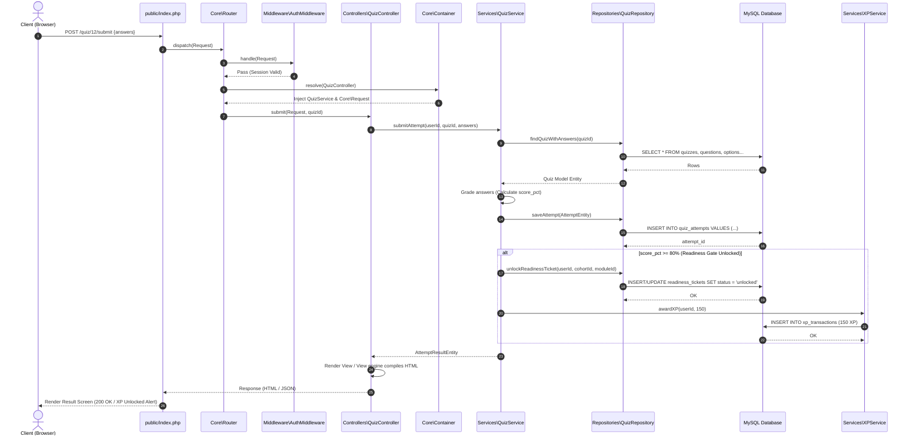
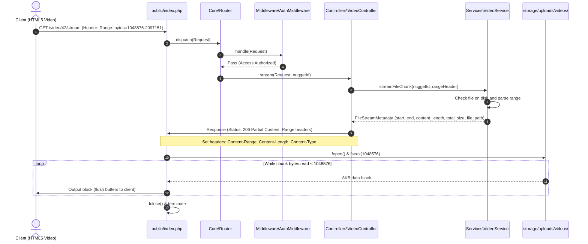

# Software Architecture Specification
## Flipped-Microlearning MOOC Platform (FMMP)

---

### Document Metadata
*   **System Title:** Software Architecture Design Specification (FMMP)
*   **Version:** 1.0.0
*   **Date:** July 14, 2026
*   **Status:** Design Proposal
*   **Author:** Lead Software Architect
*   **Coding Standards:** PSR-12 / PSR-4 Autoloading
*   **Target Environment:** PHP 8.3 / MySQL 8 / Tailwind CSS

---

## 1. Architectural Patterns & Strategy

The Flipped-Microlearning MOOC Platform (FMMP) is designed around a decoupled, highly testable custom **Model-View-Controller (MVC)** architectural pattern optimized for PHP 8.3. To manage enterprise-grade complexity within a single monolithic codebase (ready for future microservices migration if needed), we enforce a strict separation of concerns through the following layers:

```
┌────────────────────────────────────────────────────────┐
│                        CLIENT                          │
│          Web Browser (Tailwind / JS UI)                │
└──────────────────────────┬─────────────────────────────┘
                           │ HTTP Request
                           ▼
┌────────────────────────────────────────────────────────┐
│                   MIDDLEWARE PIPELINE                  │
│       Rate Limiting ➔ Auth verification ➔ RBAC         │
└──────────────────────────┬─────────────────────────────┘
                           │ Route Dispatched
                           ▼
┌────────────────────────────────────────────────────────┐
│                    CONTROLLER LAYER                    │
│    Deconstructs requests ➔ Delegates to Services       │
└───────────┬───────────────────────────────┬────────────┘
            │                               │
            ▼ Renders                       ▼ Returns JSON
┌───────────────────────┐       ┌────────────────────────┐
│      VIEW LAYER       │       │    SERVICE LAYER       │
│  SSR Tailwind Templates│       │ Domain Business Logic  │
└───────────────────────┘       └───────────┬────────────┘
                                            │ Matches
                                            ▼
                                ┌────────────────────────┐
                                │    REPOSITORY LAYER    │
                                │ Data Access Abstraction│
                                └───────────┬────────────┘
                                            │ Direct PDO
                                            ▼
                                ┌────────────────────────┐
                                │    DATABASE LAYER      │
                                │        MySQL 8         │
                                └────────────────────────┘
```

### 1.1 Architectural Pillars
1.  **Dependency Injection (DI) Container:** Utilizes a custom, PSR-11 compliant Reflection Container supporting zero-configuration auto-wiring.
2.  **Service Layer Pattern:** Encapsulates all domain-specific rules (e.g., SuperMemo-2 algorithm scheduling, readiness calculations, video progression evaluation) away from HTTP-handling controllers.
3.  **Repository Pattern:** Isolates the domain models from data access logic. All database access uses raw SQL via parameterized PDO mappings inside dedicated repositories.
4.  **Middleware Pipeline:** Filters incoming requests sequentially before they hit the controllers, handling concerns like rate limiting, authentication verification, and role-based checks.

---

## 2. Folder Structure

The application adopts standard PSR-4 namespaces mapped to the `app/` directory.

```
fitcoch/
├── app/
│   ├── Controllers/             # Controllers: Receive requests, delegate to Services, return Views/JSON
│   │   ├── [AuthController.php](file:///d:/xamp/htdocs/fitcoch/app/Controllers/AuthController.php)
│   │   ├── [CourseController.php](file:///d:/xamp/htdocs/fitcoch/app/Controllers/CourseController.php)
│   │   ├── [QuizController.php](file:///d:/xamp/htdocs/fitcoch/app/Controllers/QuizController.php)
│   │   ├── [VideoController.php](file:///d:/xamp/htdocs/fitcoch/app/Controllers/VideoController.php)
│   │   └── [AnalyticsController.php](file:///d:/xamp/htdocs/fitcoch/app/Controllers/AnalyticsController.php)
│   ├── Core/                    # Framework Foundation
│   │   ├── [Container.php](file:///d:/xamp/htdocs/fitcoch/app/Core/Container.php)        # Dependency Injection Container with Auto-wiring
│   │   ├── [Router.php](file:///d:/xamp/htdocs/fitcoch/app/Core/Router.php)           # HTTP Route Dispatcher
│   │   ├── [Request.php](file:///d:/xamp/htdocs/fitcoch/app/Core/Request.php)          # Request Value Object
│   │   ├── [Response.php](file:///d:/xamp/htdocs/fitcoch/app/Core/Response.php)         # Response Utility Wrapper
│   │   └── [Database.php](file:///d:/xamp/htdocs/fitcoch/app/Core/Database.php)         # PDO Connection Manager
│   ├── Middleware/              # HTTP Middlewares (Request Interception)
│   │   ├── [MiddlewareInterface.php](file:///d:/xamp/htdocs/fitcoch/app/Middleware/MiddlewareInterface.php)
│   │   ├── [AuthMiddleware.php](file:///d:/xamp/htdocs/fitcoch/app/Middleware/AuthMiddleware.php)
│   │   ├── [RoleMiddleware.php](file:///d:/xamp/htdocs/fitcoch/app/Middleware/RoleMiddleware.php)
│   │   └── [RateLimitMiddleware.php](file:///d:/xamp/htdocs/fitcoch/app/Middleware/RateLimitMiddleware.php)
│   ├── Models/                  # Domain Entities representing database rows
│   │   ├── User.php
│   │   ├── Course.php
│   │   ├── Nugget.php
│   │   ├── Quiz.php
│   │   └── Analytics.php
│   ├── Repositories/            # Data Access Abstraction (SQL queries mapped to Models)
│   │   ├── [RepositoryInterface.php](file:///d:/xamp/htdocs/fitcoch/app/Repositories/RepositoryInterface.php)
│   │   ├── [UserRepository.php](file:///d:/xamp/htdocs/fitcoch/app/Repositories/UserRepository.php)
│   │   ├── [NuggetRepository.php](file:///d:/xamp/htdocs/fitcoch/app/Repositories/NuggetRepository.php)
│   │   ├── [QuizRepository.php](file:///d:/xamp/htdocs/fitcoch/app/Repositories/QuizRepository.php)
│   │   └── [AnalyticsRepository.php](file:///d:/xamp/htdocs/fitcoch/app/Repositories/AnalyticsRepository.php)
│   ├── Services/                # Service Layer: Business Logic & Orchestration
│   │   ├── [AuthService.php](file:///d:/xamp/htdocs/fitcoch/app/Services/AuthService.php)
│   │   ├── [QuizService.php](file:///d:/xamp/htdocs/fitcoch/app/Services/QuizService.php)
│   │   ├── [VideoService.php](file:///d:/xamp/htdocs/fitcoch/app/Services/VideoService.php)
│   │   ├── [AnalyticsService.php](file:///d:/xamp/htdocs/fitcoch/app/Services/AnalyticsService.php)
│   │   └── [FileUploadService.php](file:///d:/xamp/htdocs/fitcoch/app/Services/FileUploadService.php)
│   └── Views/                   # View Templates (Server-Side Rendered PHP with Tailwind)
│       ├── layouts/             # Base layouts (headers, footers)
│       ├── auth/                # Login, registration pages
│       ├── courses/             # Nugget view grids, detail outlines
│       ├── quizzes/             # Active assessment screens
│       └── dashboard/           # Analytics displays
├── bootstrap/
│   └── [app.php](file:///d:/xamp/htdocs/fitcoch/bootstrap/app.php)                  # Entry bootstrap loader configures container
├── config/                      # Application Configurations
│   ├── app.php
│   ├── database.php
│   └── storage.php
├── docs/                        # Architecture and System Documentation
│   └── [ARCHITECTURE.md](file:///d:/xamp/htdocs/fitcoch/docs/ARCHITECTURE.md)
├── public/                      # Web Server root directory
│   ├── [index.php](file:///d:/xamp/htdocs/fitcoch/public/index.php)                # Front Controller (Single entry point)
│   ├── assets/                  # Compiled Tailwind CSS and bundle JS
│   └── uploads/                 # Local directory for user file uploads
├── storage/                     # App-writable directories
│   ├── logs/                    # Application error and performance logs
│   └── cache/                   # Cache configurations
├── tests/                       # Automated Test Suites
│   ├── Unit/
│   └── Integration/
├── composer.json                # Composer autoloading and dependencies configuration
└── README.md
```

---

## 3. Request & Response Flow

All client interactions transit through a single point of entry, executing validation, interception, processing, and emission in a structured workflow.

### 3.1 Request Flow
1.  **Web Request:** Client requests an endpoint (e.g. `POST /quiz/submit`).
2.  **Web Server Handling:** Apache/Nginx maps the request to `public/index.php` using rewrite rules.
3.  **Bootstrapping:** `public/index.php` executes `bootstrap/app.php`, configuring autoloading, configuration files, and initializing the DI Container (`Core\Container`).
4.  **Routing:** `Core\Router` evaluates the HTTP request method and URI. It maps the URI to a designated controller action.
5.  **Middleware Execution Pipeline:** The Router executes the matched route's assigned middlewares (e.g., `RateLimitMiddleware` ➔ `AuthMiddleware` ➔ `RoleMiddleware`).
    *   *Short-Circuiting:* If a middleware fails (e.g., user is unauthorized), it constructs a terminating response object and halts the request pipeline.
6.  **Dependency Resolution:** The router invokes the Controller action. The container resolves all parameter dependencies (services, repositories) of the controller constructor and method via reflection.
7.  **Service Processing:** The controller extracts validated inputs and commands the Service Layer (e.g., `QuizService`) to perform business execution.
8.  **Data Operations:** The Service coordinates transactions across multiple Repositories, executing statements through secure PDO bindings.

### 3.2 Response Flow
1.  **Response Construction:** The Controller processes data returned from the service. It constructs a `Core\Response` object.
    *   *HTML Rendering:* It loads views from `app/Views/` merging variables.
    *   *API Response:* It sets headers to `Content-Type: application/json` and serializes output.
2.  **Post-Processing Middleware:** The response object flows back through the middleware stack in reverse order, allowing post-dispatch headers (e.g., CORS, Content-Security-Policy) to be added.
3.  **Emission:** The Front Controller calls `$response->send()`, transmitting HTTP headers and output strings to the Client.

---

## 4. Sequence Diagrams

### 4.1 Use Case: Submit Readiness Quiz (Unlocking live ticket Gate)
The following sequence details how a Learner attempts the readiness quiz, triggering evaluations, DB transactions, XP distribution, and readiness ticket validation.



### 4.2 Use Case: Chunked Video Nugget Streaming
This sequence highlights the byte-range rendering flow within the custom PHP framework to support scrubbing and partial media consumption without memory exhaustion.



---

## 5. Architectural Components

### 5.1 Dependency Injection (DI) Container Engine
The DI Engine uses PHP 8 Reflection to automatically instantiate classes and inject required dependencies recursively based on type-hints.

```php
<?php
namespace App\Core;

use ReflectionClass;
use Exception;

class Container {
    private array $instances = [];
    private array $bindings = [];

    public function bind(string $key, callable|string $resolver): void {
        $this->bindings[$key] = $resolver;
    }

    public function singleton(string $key, object $instance): void {
        $this->instances[$key] = $instance;
    }

    public function get(string $id): mixed {
        if (isset($this->instances[$id])) {
            return $this->instances[$id];
        }

        if (isset($this->bindings[$id])) {
            $resolver = $this->bindings[$id];
            if (is_callable($resolver)) {
                return $resolver($this);
            }
            return $this->resolve($resolver);
        }

        return $this->resolve($id);
    }

    private function resolve(string $className): mixed {
        if (!class_exists($className)) {
            throw new Exception("Class {$className} does not exist.");
        }

        $reflector = new ReflectionClass($className);
        if (!$reflector->isInstantiable()) {
            throw new Exception("Class {$className} cannot be instantiated.");
        }

        $constructor = $reflector->getConstructor();
        if ($constructor === null) {
            return new $className();
        }

        $parameters = $constructor->getParameters();
        $dependencies = [];

        foreach ($parameters as $parameter) {
            $type = $parameter->getType();
            if ($type === null) {
                if ($parameter->isDefaultValueAvailable()) {
                    $dependencies[] = $parameter->getDefaultValue();
                    continue;
                }
                throw new Exception("Cannot resolve parameter {$parameter->getName()} in constructor of {$className}.");
            }
            
            $dependencies[] = $this->get($type->getName());
        }

        $instance = $reflector->newInstanceArgs($dependencies);
        return $instance;
    }
}
```

---

### 5.2 Repository Pattern & Service Layer
*   **Repositories:** Deal purely with mapping rows to domain Models. They hold zero business logic.
*   **Services:** Handle workflow logic, check access credentials, execute state transitions, and enforce platform boundaries.

#### UserRepository Example
```php
<?php
namespace App\Repositories;

use App\Core\Database;
use App\Models\User;

class UserRepository {
    public function __construct(private Database $db) {}

    public function findById(int $id): ?User {
        $stmt = $this->db->prepare("SELECT * FROM users WHERE id = :id LIMIT 1");
        $stmt->execute(['id' => $id]);
        $row = $stmt->fetch();
        
        return $row ? User::fromArray($row) : null;
    }

    public function findByEmail(string $email): ?User {
        $stmt = $this->db->prepare("SELECT * FROM users WHERE email = :email LIMIT 1");
        $stmt->execute(['email' => $email]);
        $row = $stmt->fetch();
        
        return $row ? User::fromArray($row) : null;
    }
}
```

#### AuthService Example
```php
<?php
namespace App\Services;

use App\Repositories\UserRepository;
use App\Models\User;
use Exception;

class AuthService {
    public function __construct(private UserRepository $userRepo) {}

    public function authenticate(string $email, string $password): User {
        $user = $this->userRepo->findByEmail($email);
        
        if (!$user) {
            throw new Exception("Invalid login credentials.");
        }

        if ($user->status === 'suspended') {
            throw new Exception("Account has been suspended.");
        }

        if (!password_verify($password, $user->password_hash)) {
            throw new Exception("Invalid login credentials.");
        }

        // Initialize session tokens/cookies
        $_SESSION['user_id'] = $user->id;
        
        return $user;
    }
}
```

---

### 5.3 Middleware Pipeline
The middleware layer dynamically wraps the request execution. All middlewares implement `MiddlewareInterface`.

```php
<?php
namespace App\Middleware;

use App\Core\Request;
use App\Core\Response;

interface MiddlewareInterface {
    public function handle(Request $request, callable $next): Response;
}
```

#### Authentication Middleware Implementation
```php
<?php
namespace App\Middleware;

use App\Core\Request;
use App\Core\Response;

class AuthMiddleware implements MiddlewareInterface {
    public function handle(Request $request, callable $next): Response {
        if (!isset($_SESSION['user_id'])) {
            // Unauthenticated response
            return new Response(
                body: json_encode(['error' => 'Unauthenticated access.']),
                statusCode: 401,
                headers: ['Content-Type' => 'application/json']
            );
        }
        
        // Propagate user context in request attributes
        $request->setAttribute('user_id', $_SESSION['user_id']);
        
        return $next($request);
    }
}
```

---

### 5.4 Authentication & Authorization
*   **Authentication (Session/JWT):** Default state is session cookie authentication utilizing Redis for distributed session storage (under production load). Rest APIs authenticate via standard bearer JWT validation.
*   **Role-Based Access Control (RBAC):** Users hold mappings in `user_roles` linking to specific system roles: `learner`, `instructor`, `admin`.
*   **Authorization Engine:** Enforces granular operation permissions by auditing relationship policies. For instance, checks if a learner is actively enrolled in a specific class or holds the unlocked readiness ticket before entering.

```php
<?php
namespace App\Services;

use App\Core\Database;

class AuthorizationService {
    public function __construct(private Database $db) {}

    public function hasRole(int $userId, string $roleName): bool {
        $stmt = $this->db->prepare("
            SELECT 1 FROM user_roles ur
            JOIN roles r ON ur.role_id = r.id
            WHERE ur.user_id = :user_id AND r.name = :role_name
        ");
        $stmt->execute(['user_id' => $userId, 'role_name' => $roleName]);
        return (bool)$stmt->fetchColumn();
    }

    public function canAccessLiveSession(int $userId, int $cohortId, int $moduleId): bool {
        // Evaluate readiness gate logic (BR-01)
        $stmt = $this->db->prepare("
            SELECT status FROM readiness_tickets 
            WHERE user_id = :user_id AND cohort_id = :cohort_id AND module_id = :module_id
        ");
        $stmt->execute([
            'user_id' => $userId,
            'cohort_id' => $cohortId,
            'module_id' => $moduleId
        ]);
        
        $ticket = $stmt->fetchColumn();
        return in_array($ticket, ['unlocked', 'overridden'], true);
    }
}
```

---

### 5.5 File Upload Engine
File uploads are isolated from client-facing directories to prevent scripts execution.
1.  **Validations:** Rigidly checks size limitations, validates physical signatures (MIME verification, not simple extension scans), and cleanses filenames.
2.  **Unique Hashing:** Files are stored under UUID filenames containing timestamps (`/storage/uploads/`).
3.  **Storage Providers:** Implements `StorageProviderInterface` facilitating local disk deployment (XAMPP dev) and Amazon S3 storage (production configuration).

```php
<?php
namespace App\Services;

use Exception;

class FileUploadService {
    private const ALLOWED_MIMES = [
        'video/mp4' => 'mp4',
        'video/webm' => 'webm',
        'image/jpeg' => 'jpg',
        'image/png' => 'png'
    ];
    private const MAX_SIZE = 100 * 1024 * 1024; // 100MB limit

    public function upload(array $fileData, string $destinationDir): string {
        if ($fileData['error'] !== UPLOAD_ERR_OK) {
            throw new Exception("File upload failed with error code: " . $fileData['error']);
        }

        if ($fileData['size'] > self::MAX_SIZE) {
            throw new Exception("File size exceeds safety limitations.");
        }

        // MIME Validation using finfo
        $finfo = new \finfo(FILEINFO_MIME_TYPE);
        $mime = $finfo->file($fileData['tmp_name']);

        if (!array_key_exists($mime, self::ALLOWED_MIMES)) {
            throw new Exception("Unsupported file format: {$mime}");
        }

        $extension = self::ALLOWED_MIMES[$mime];
        $safeName = bin2hex(random_bytes(16)) . '.' . $extension;
        $targetPath = $destinationDir . DIRECTORY_SEPARATOR . $safeName;

        if (!move_uploaded_file($fileData['tmp_name'], $targetPath)) {
            throw new Exception("Unable to finalize storage transfer.");
        }

        return $safeName;
    }
}
```

---

### 5.6 Video Streaming
Serves chunks of videos by capturing standard range headers (`Range: bytes=start-end`), responding with `206 Partial Content`. This avoids memory exhaustion during high video traffic concurrency.

```php
<?php
namespace App\Services;

class VideoService {
    public function stream(string $filePath): void {
        if (!file_exists($filePath)) {
            header("HTTP/1.1 404 Not Found");
            exit;
        }

        $size = filesize($filePath);
        $length = $size;
        $start = 0;
        $end = $size - 1;

        // Ensure output buffers are disabled to allow streaming
        if (ob_get_level()) {
            ob_end_clean();
        }

        header("Accept-Ranges: bytes");
        header("Content-Type: video/mp4");

        if (isset($_SERVER['HTTP_RANGE'])) {
            $c_start = $start;
            $c_end = $end;

            list(, $range) = explode('=', $_SERVER['HTTP_RANGE'], 2);
            if (strpos($range, ',') !== false) {
                header("HTTP/1.1 416 Requested Range Not Satisfiable");
                header("Content-Range: bytes */$size");
                exit;
            }
            if ($range == '-') {
                $c_start = $size - substr($range, 1);
            } else {
                $range = explode('-', $range);
                $c_start = $range[0];
                $c_end = (isset($range[1]) && is_numeric($range[1])) ? $range[1] : $size - 1;
            }
            $c_end = ($c_end > $end) ? $end : $c_end;
            if ($c_start > $c_end || $c_start > $size - 1 || $c_end >= $size) {
                header("HTTP/1.1 416 Requested Range Not Satisfiable");
                header("Content-Range: bytes */$size");
                exit;
            }
            $start = $c_start;
            $end = $c_end;
            $length = $end - $start + 1;
            
            header("HTTP/1.1 206 Partial Content");
            header("Content-Range: bytes $start-$end/$size");
        }

        header("Content-Length: " . $length);

        $fp = fopen($filePath, 'rb');
        fseek($fp, $start);
        
        $buffer = 8192; // 8KB read blocks
        $bytesSent = 0;

        while (!feof($fp) && $bytesSent < $length) {
            $toRead = min($buffer, $length - $bytesSent);
            $data = fread($fp, $toRead);
            echo $data;
            flush();
            $bytesSent += strlen($data);
        }
        fclose($fp);
        exit;
    }
}
```

---

### 5.7 Quiz & Spaced Repetition Engine
1.  **Readiness Quiz Engine:** Requires grading client-submitted MCQ sets. If user score evaluates $\ge 80\%$, the module readiness ticket unlocks.
2.  **Spaced Repetition Engine (SM2 Algorithm):** Evaluates user reviews and recalculates repetition schedules.

#### Mathematical Calculation
The SuperMemo-2 (SM-2) algorithm processes user recall score inputs $q$ ($0$ to $5$ quality ratings) to output new review intervals $I_n$ and updated Easiness Factors $EF$.

*   **If response is correct ($q \ge 3$):**
    *   $I_1 = 1\text{ day}$
    *   $I_2 = 6\text{ days}$
    *   $I_n = I_{n-1} \times EF_{n-1}$ (for $n > 2$)
*   **If response is incorrect ($q < 3$):**
    *   The repetition counter resets back to start ($n = 1$, setting $I_1 = 1\text{ day}$).
*   **Easiness Factor Update Formula:**
    $$EF_{new} = EF_{old} + (0.1 - (5 - q) \times (0.08 + (5 - q) \times 0.02))$$
    *Where $EF_{new}$ holds a minimum floor of $1.3$.*

#### QuizService Code
```php
<?php
namespace App\Services;

class QuizService {
    private const MIN_EF = 1.3;

    /**
     * Update Spaced Repetition schedule using the SM-2 algorithm.
     * 
     * @param float $oldEF Old Easiness Factor
     * @param int $repetitionCount Current number of successful trials
     * @param int $rating Score rating (0-5 representing recall quality)
     * @return array Contains: next_interval_days, new_easiness_factor, new_repetition_count
     */
    public function calculateSM2(float $oldEF, int $repetitionCount, int $rating): array {
        if ($rating < 0 || $rating > 5) {
            $rating = 0;
        }

        // 1. Calculate new Easiness Factor (EF)
        $newEF = $oldEF + (0.1 - (5 - $rating) * (0.08 + (5 - $rating) * 0.02));
        if ($newEF < self::MIN_EF) {
            $newEF = self::MIN_EF;
        }

        // 2. Determine repetition count & next review interval
        if ($rating >= 3) {
            if ($repetitionCount === 0) {
                $intervalDays = 1;
                $newRepetition = 1;
            } elseif ($repetitionCount === 1) {
                $intervalDays = 6;
                $newRepetition = 2;
            } else {
                $intervalDays = (int)ceil($repetitionCount * $newEF);
                $newRepetition = $repetitionCount + 1;
            }
        } else {
            // Incorrect answer - reset schedule but preserve structural Easiness Factor
            $intervalDays = 1;
            $newRepetition = 0;
        }

        return [
            'interval_days' => $intervalDays,
            'easiness_factor' => $newEF,
            'repetition_count' => $newRepetition
        ];
    }
}
```

---

### 5.8 Learning Analytics Architecture
The system utilizes continuous interaction tracking.
*   **Data Aggregation Pipeline:** Video playback heartbeats are transmitted asynchronously from client players to a raw audit logger.
*   **Materialized Aggregates:** Rather than joining massive raw data tables on active loads, background queues (or CRON tasks in standard MVC deployment) compile progress aggregates into indices (e.g., readiness rates, at-risk users) updating the tables `nugget_progress` and `readiness_tickets` regularly.
*   **At-Risk Queries:** Aggregated schedules identify learners who missed preparation requirements multiple times consecutively.

```php
<?php
namespace App\Services;

use App\Repositories\AnalyticsRepository;

class AnalyticsService {
    public function __construct(private AnalyticsRepository $analyticsRepo) {}

    /**
     * Identify users whose preparation records are consistently missing.
     * Evaluated when T - 12 hours check (BR-04) executes.
     */
    public function getAtRiskLearners(int $cohortId, int $limit = 3): array {
        return $this->analyticsRepo->findAtRiskLearners($cohortId, $limit);
    }

    /**
     * Compute the readiness analytics score of a cohort.
     */
    public function computeCohortReadinessMetrics(int $cohortId, int $moduleId): array {
        $totalEnrolled = $this->analyticsRepo->getTotalEnrolledCount($cohortId);
        $completedPrep = $this->analyticsRepo->getCompletedPrepCount($cohortId, $moduleId);
        
        $ratio = $totalEnrolled > 0 ? ($completedPrep / $totalEnrolled) : 0.0;
        
        return [
            'enrolled' => $totalEnrolled,
            'prepared' => $completedPrep,
            'readiness_ratio' => $ratio,
            'trigger_low_readiness_alert' => ($ratio < 0.60) // BR-04
        ];
    }
}
```

---

## 6. Deployment & Infrastructure Architecture

The platform scales from local XAMPP sandbox developer instances to multi-tier cloud environments.

```
                  ┌──────────────────────────────┐
                  │          CDN Layer           │
                  │   Cloudflare / CloudFront    │
                  └──────────────┬───────────────┘
                                 │
                  ┌──────────────┴───────────────┐
                  │       API Gateway /          │
                  │       Load Balancer          │
                  └──────────────┬───────────────┘
                                 │
           ┌─────────────────────┼─────────────────────┐
           ▼                     ▼                     ▼
 ┌───────────────────┐ ┌───────────────────┐ ┌───────────────────┐
 │   Application     │ │   Application     │ │   Application     │
 │    Web Node 1     │ │    Web Node 2     │ │    Web Node 3     │
 │ (PHP-FPM / Nginx) │ │ (PHP-FPM / Nginx) │ │ (PHP-FPM / Nginx) │
 └─────────┬─────────┘ └─────────┬─────────┘ └─────────┬─────────┘
           │                     │                     │
           └─────────────────────┼─────────────────────┘
                                 │
     ┌───────────────────────────┴───────────────────────────┐
     ▼                                                       ▼
┌─────────┐                                             ┌─────────┐
│  Redis  │ ◄── [Shared Session / Locks / WebSockets] ──► │  MySQL  │
│ Cluster │                                             │ Cluster │
└─────────┘                                             └─────────┘
```

### 6.1 Dev Infrastructure (XAMPP Sandbox)
*   **Server Engine:** Apache with `mod_rewrite` parsing to Front Controller (`public/index.php`).
*   **PHP Runtime:** PHP 8.3 Core.
*   **Database:** Local MySQL 8.
*   **Storage:** Local directory link storage (`storage/uploads/`).

### 6.2 Cloud Production Topology
*   **Client Delivery:** Cloudflare handles DDoS mitigation, SSL/TLS terminates at load balancer level, and static resources + video segments are cached on CDN edges.
*   **Server Nodes:** Multiple horizontal instances of Nginx + PHP-FPM running behind an Application Load Balancer (ALB).
*   **Session State Cluster:** Shared Redis Server handling session cache allocations.
*   **Relational Datastore:** Master-Replica MySQL 8 instance cluster (AWS RDS) enabling fast analytic read locks without blocking writes.
*   **Asset / Video Storage:** AWS S3 buckets (private object storage) serving videos through CloudFront signed cookies.
