# Database Design Specification (MySQL 8)
## Flipped-Microlearning MOOC Platform (FMMP)

---

### Document Metadata
*   **System Title:** Relational Database Architecture (FMMP)
*   **Version:** 1.0.0
*   **Date:** July 14, 2026
*   **Status:** Design Approved
*   **Author:** Senior Software Architect
*   **Workspace Location:** `C:\Users\wpach\.gemini\antigravity\scratch\mooc-flipped-microlearning`

---

## 1. Introduction & Design Principles

This document defines the relational database schema for the Flipped-Microlearning MOOC Platform (FMMP), optimized for **MySQL 8**. The schema is engineered to satisfy **Third Normal Form (3NF)** to eliminate redundancy and maintain database consistency.

### 1.1 Third Normal Form (3NF) Compliance Strategies
*   **Elimination of Repeating Groups (1NF):** Every column contains atomic values. Multi-valued elements (e.g., student answers, user roles) are separated into dedicated tables.
*   **Full Functional Dependency (2NF):** All non-key attributes are fully dependent on the primary key. In composite primary key tables (e.g., `nugget_progress`), non-key columns (e.g., `progress_percentage`) depend on the complete key combination.
*   **No Transitive Dependencies (3NF):** No non-key attributes determine other non-key attributes. For example, in quizzes and live polls, we reference entities using local identifiers (composite keys like `(question_id, option_number)`) instead of global candidate keys that transitively reference other parents, avoiding structural update anomalies.

### 1.2 Naming Conventions
*   **Database Objects:** Lowercase `snake_case` for all tables, columns, indexes, and constraints.
*   **Table Names:** Plural nouns representing the collection of entities (e.g., `users`, `cohort_enrollments`).
*   **Primary Keys:** Named `id` (using `BIGINT UNSIGNED AUTO_INCREMENT`) for primary entity tables. Natural composite keys `(fk_1, fk_2)` are utilized for junction and weak tables.
*   **Foreign Keys:** Named `singular_table_name_id` matching the referenced table (e.g., `user_id` references `users.id`).
*   **Indexes:**
    *   Primary Keys: Implicit `PRIMARY`
    *   Unique Key Indexes: `uq_[table_name]_[column_name(s)]`
    *   Non-Unique Indexes: `idx_[table_name]_[column_name(s)]`
*   **Boolean Fields:** Prefixed with `is_` or `has_` (stored as `TINYINT(1)`).
*   **Timestamps:** Named `created_at` and `updated_at` (stored as `DATETIME` with default current timestamp).

---

## 2. Entity-Relationship (ER) Diagram

The diagram below represents the logical relationships and cardinality rules across the system modules:

```mermaid
erDiagram
    USERS ||--o{ USER_ROLES : has
    ROLES ||--o{ USER_ROLES : grants

    USERS ||--o{ COHORT_ENROLLMENTS : joins
    COHORTS ||--o{ COHORT_ENROLLMENTS : contains
    COURSES ||--o{ COHORTS : organizes

    COURSES ||--o{ MODULES : contains
    MODULES ||--o{ NUGGETS : contains
    NUGGETS ||--o{ NUGGET_PROGRESS : tracks
    USERS ||--o{ NUGGET_PROGRESS : logs

    MODULES ||--o{ QUIZZES : tests
    QUIZZES ||--o{ QUESTIONS : contains
    QUESTIONS ||--o{ OPTIONS : defines
    USERS ||--o{ QUIZ_ATTEMPTS : performs
    QUIZZES ||--o{ QUIZ_ATTEMPTS : logs
    QUIZ_ATTEMPTS ||--o{ QUIZ_RESPONSES : submits
    QUESTIONS ||--o{ QUIZ_RESPONSES : answers

    USERS ||--o{ READINESS_TICKETS : holds
    COHORTS ||--o{ READINESS_TICKETS : validates
    MODULES ||--o{ READINESS_TICKETS : guards

    COHORTS ||--o{ LIVE_SESSIONS : hosts
    MODULES ||--o{ LIVE_SESSIONS : maps
    LIVE_SESSIONS ||--o{ LIVE_ATTENDANCE : logs
    USERS ||--o{ LIVE_ATTENDANCE : registers

    LIVE_SESSIONS ||--o{ LIVE_POLLS : conducts
    LIVE_POLLS ||--o{ LIVE_POLL_OPTIONS : displays
    LIVE_POLLS ||--o{ LIVE_POLL_RESPONSES : gathers
    USERS ||--o{ LIVE_POLL_RESPONSES : submits

    USERS ||--o{ SPACED_REP_SCHEDULES : manages
    COURSES ||--o{ KNOWLEDGE_ITEMS : defines
    KNOWLEDGE_ITEMS ||--o{ SPACED_REP_SCHEDULES : reviews

    USERS ||--o| USER_STREAKS : tracks
    USERS ||--o{ XP_TRANSACTIONS : logs
    BADGES ||--o{ USER_BADGES : grants
    USERS ||--o{ USER_BADGES : earns

    USER_ROLES {
        bigint user_id FK
        bigint role_id FK
    }
    COHORT_ENROLLMENTS {
        bigint cohort_id FK
        bigint user_id FK
        varchar status
    }
    NUGGET_PROGRESS {
        bigint user_id FK
        bigint nugget_id FK
        tinyint progress_percentage
        varchar status
    }
    READINESS_TICKETS {
        bigint user_id FK
        bigint cohort_id FK
        bigint module_id FK
        varchar status
    }
    OPTIONS {
        bigint question_id FK
        tinyint option_number PK
        varchar option_text
        tinyint is_correct
    }
    QUIZ_RESPONSES {
        bigint quiz_attempt_id FK
        bigint question_id FK
        tinyint selected_option_number FK
    }
    LIVE_POLL_OPTIONS {
        bigint live_poll_id FK
        tinyint option_number PK
        varchar option_text
        tinyint is_correct
    }
    LIVE_POLL_RESPONSES {
        bigint live_poll_id FK
        bigint user_id FK
        tinyint selected_option_number FK
    }
    SPACED_REP_SCHEDULES {
        bigint user_id FK
        bigint knowledge_item_id FK
        int interval_days
        decimal easiness_factor
    }
```



---

## 3. Data Dictionary

### 3.1 System & Authentication Module

#### 3.1.1 `users`
Stores user profile records and core identity details.
*   **Engine:** InnoDB
*   **Charset:** utf8mb4_unicode_ci

| Column Name | Data Type | Nullable | Key | Default | Constraints / Description |
| :--- | :--- | :--- | :--- | :--- | :--- |
| `id` | BIGINT UNSIGNED | NO | PK | *None* | AUTO_INCREMENT |
| `email` | VARCHAR(255) | NO | UK | *None* | Must contain `@` (application level / check constraint) |
| `password_hash` | VARCHAR(255) | NO | | *None* | Secure hashing (Argon2id/bcrypt) |
| `first_name` | VARCHAR(100) | NO | | *None* | |
| `last_name` | VARCHAR(100) | NO | | *None* | |
| `status` | ENUM('active', 'suspended') | NO | | 'active' | User state control |
| `timezone` | VARCHAR(50) | NO | | 'UTC' | Required for local midnight streak checks |
| `created_at` | DATETIME | NO | | CURRENT_TIMESTAMP| |
| `updated_at` | DATETIME | NO | | CURRENT_TIMESTAMP| ON UPDATE CURRENT_TIMESTAMP |

*   **Indexes:**
    *   `PRIMARY` (`id`)
    *   `uq_users_email` (`email`)

#### 3.1.2 `roles`
Stores access control roles.
*   **Engine:** InnoDB

| Column Name | Data Type | Nullable | Key | Default | Constraints / Description |
| :--- | :--- | :--- | :--- | :--- | :--- |
| `id` | TINYINT UNSIGNED | NO | PK | *None* | AUTO_INCREMENT |
| `name` | VARCHAR(50) | NO | UK | *None* | 'learner', 'instructor', 'admin' |
| `description` | VARCHAR(255) | YES | | NULL | |

*   **Indexes:**
    *   `PRIMARY` (`id`)
    *   `uq_roles_name` (`name`)

#### 3.1.3 `user_roles`
Junction table mapping users to roles (Many-to-Many).
*   **Engine:** InnoDB

| Column Name | Data Type | Nullable | Key | Default | Constraints / Description |
| :--- | :--- | :--- | :--- | :--- | :--- |
| `user_id` | BIGINT UNSIGNED | NO | PK, FK | *None* | REFERENCES `users.id` ON DELETE CASCADE |
| `role_id` | TINYINT UNSIGNED | NO | PK, FK | *None* | REFERENCES `roles.id` ON DELETE RESTRICT |

*   **Indexes:**
    *   `PRIMARY` (`user_id`, `role_id`)
    *   `idx_user_roles_role` (`role_id`)

---

### 3.2 Course & Curriculum Module

#### 3.2.1 `courses`
Holds core course metadata.

| Column Name | Data Type | Nullable | Key | Default | Constraints / Description |
| :--- | :--- | :--- | :--- | :--- | :--- |
| `id` | BIGINT UNSIGNED | NO | PK | *None* | AUTO_INCREMENT |
| `title` | VARCHAR(255) | NO | | *None* | |
| `description` | TEXT | YES | | NULL | |
| `status` | ENUM('draft', 'published', 'archived') | NO | | 'draft' | |
| `created_at` | DATETIME | NO | | CURRENT_TIMESTAMP| |
| `updated_at` | DATETIME | NO | | CURRENT_TIMESTAMP| ON UPDATE CURRENT_TIMESTAMP |

*   **Indexes:**
    *   `PRIMARY` (`id`)
    *   `idx_courses_status` (`status`)

#### 3.2.2 `cohorts`
Represents scheduled runs/terms of a course.

| Column Name | Data Type | Nullable | Key | Default | Constraints / Description |
| :--- | :--- | :--- | :--- | :--- | :--- |
| `id` | BIGINT UNSIGNED | NO | PK | *None* | AUTO_INCREMENT |
| `course_id` | BIGINT UNSIGNED | NO | FK | *None* | REFERENCES `courses.id` ON DELETE RESTRICT |
| `name` | VARCHAR(100) | NO | | *None* | e.g. "Fall 2026" |
| `start_date` | DATE | NO | | *None* | |
| `end_date` | DATE | NO | | *None* | CHECK (`end_date` >= `start_date`) |
| `created_at` | DATETIME | NO | | CURRENT_TIMESTAMP| |
| `updated_at` | DATETIME | NO | | CURRENT_TIMESTAMP| ON UPDATE CURRENT_TIMESTAMP |

*   **Indexes:**
    *   `PRIMARY` (`id`)
    *   `idx_cohorts_course` (`course_id`)

#### 3.2.3 `cohort_enrollments`
Junction table tracking student enrollment in cohorts.

| Column Name | Data Type | Nullable | Key | Default | Constraints / Description |
| :--- | :--- | :--- | :--- | :--- | :--- |
| `cohort_id` | BIGINT UNSIGNED | NO | PK, FK | *None* | REFERENCES `cohorts.id` ON DELETE RESTRICT |
| `user_id` | BIGINT UNSIGNED | NO | PK, FK | *None* | REFERENCES `users.id` ON DELETE CASCADE |
| `enrolled_at` | DATETIME | NO | | CURRENT_TIMESTAMP| |
| `status` | ENUM('active', 'completed', 'dropped') | NO | | 'active' | |

*   **Indexes:**
    *   `PRIMARY` (`cohort_id`, `user_id`)
    *   `idx_cohort_enrollments_user` (`user_id`)

#### 3.2.4 `modules`
Logical structure grouping learning content.

| Column Name | Data Type | Nullable | Key | Default | Constraints / Description |
| :--- | :--- | :--- | :--- | :--- | :--- |
| `id` | BIGINT UNSIGNED | NO | PK | *None* | AUTO_INCREMENT |
| `course_id` | BIGINT UNSIGNED | NO | FK | *None* | REFERENCES `courses.id` ON DELETE CASCADE |
| `title` | VARCHAR(255) | NO | | *None* | |
| `sequence_order` | SMALLINT UNSIGNED | NO | | 1 | Sorting index inside the course |
| `created_at` | DATETIME | NO | | CURRENT_TIMESTAMP| |

*   **Indexes:**
    *   `PRIMARY` (`id`)
    *   `uq_modules_course_sequence` (`course_id`, `sequence_order`)

#### 3.2.5 `nuggets`
Bite-sized microlearning contents (videos, reading cards, check-quizzes).

| Column Name | Data Type | Nullable | Key | Default | Constraints / Description |
| :--- | :--- | :--- | :--- | :--- | :--- |
| `id` | BIGINT UNSIGNED | NO | PK | *None* | AUTO_INCREMENT |
| `module_id` | BIGINT UNSIGNED | NO | FK | *None* | REFERENCES `modules.id` ON DELETE CASCADE |
| `title` | VARCHAR(255) | NO | | *None* | |
| `nugget_type` | ENUM('video', 'reading', 'quiz') | NO | | *None* | |
| `content_url` | VARCHAR(512) | YES | | NULL | Video stream URL or document resource URL |
| `content_body` | MEDIUMTEXT | YES | | NULL | Textual body for cards |
| `duration_seconds`| SMALLINT UNSIGNED | NO | | 0 | Expected completion duration |
| `sequence_order` | SMALLINT UNSIGNED | NO | | 1 | Sorting index inside the module |
| `created_at` | DATETIME | NO | | CURRENT_TIMESTAMP| |

*   **Indexes:**
    *   `PRIMARY` (`id`)
    *   `uq_nuggets_module_sequence` (`module_id`, `sequence_order`)

#### 3.2.6 `nugget_progress`
Tracks user completion and interaction metrics for each micro-nugget.

| Column Name | Data Type | Nullable | Key | Default | Constraints / Description |
| :--- | :--- | :--- | :--- | :--- | :--- |
| `user_id` | BIGINT UNSIGNED | NO | PK, FK | *None* | REFERENCES `users.id` ON DELETE CASCADE |
| `nugget_id` | BIGINT UNSIGNED | NO | PK, FK | *None* | REFERENCES `nuggets.id` ON DELETE CASCADE |
| `progress_percentage`| TINYINT UNSIGNED | NO | | 0 | 0 to 100, CHECK (`progress_percentage` <= 100) |
| `status` | ENUM('in_progress', 'completed') | NO | | 'in_progress' | |
| `completed_at` | DATETIME | YES | | NULL | Populated when status transitions to completed |
| `updated_at` | DATETIME | NO | | CURRENT_TIMESTAMP| ON UPDATE CURRENT_TIMESTAMP |

*   **Indexes:**
    *   `PRIMARY` (`user_id`, `nugget_id`)
    *   `idx_nugget_progress_nugget` (`nugget_id`)

---

### 3.3 Assessment & Flipped Gate Module

#### 3.3.1 `quizzes`
Quizzes used for pre-class verification or post-class reinforcement.

| Column Name | Data Type | Nullable | Key | Default | Constraints / Description |
| :--- | :--- | :--- | :--- | :--- | :--- |
| `id` | BIGINT UNSIGNED | NO | PK | *None* | AUTO_INCREMENT |
| `module_id` | BIGINT UNSIGNED | NO | FK | *None* | REFERENCES `modules.id` ON DELETE CASCADE |
| `quiz_type` | ENUM('readiness', 'post_class') | NO | | 'readiness'| |
| `title` | VARCHAR(255) | NO | | *None* | |
| `passing_score_pct`| TINYINT UNSIGNED | NO | | 80 | Default readiness threshold is 80% |
| `created_at` | DATETIME | NO | | CURRENT_TIMESTAMP| |

*   **Indexes:**
    *   `PRIMARY` (`id`)
    *   `idx_quizzes_module` (`module_id`)

#### 3.3.2 `questions`
Individual quiz questions.

| Column Name | Data Type | Nullable | Key | Default | Constraints / Description |
| :--- | :--- | :--- | :--- | :--- | :--- |
| `id` | BIGINT UNSIGNED | NO | PK | *None* | AUTO_INCREMENT |
| `quiz_id` | BIGINT UNSIGNED | NO | FK | *None* | REFERENCES `quizzes.id` ON DELETE CASCADE |
| `question_text` | TEXT | NO | | *None* | |
| `question_type` | ENUM('single_choice', 'multiple_choice', 'open') | NO | | 'single_choice'| |
| `points` | TINYINT UNSIGNED | NO | | 10 | Weight score points |

*   **Indexes:**
    *   `PRIMARY` (`id`)
    *   `idx_questions_quiz` (`quiz_id`)

#### 3.3.3 `options`
Potential options for quiz questions.
To satisfy **3NF** and prevent global option identifier dependencies, we use a **composite primary key** `(question_id, option_number)`.

| Column Name | Data Type | Nullable | Key | Default | Constraints / Description |
| :--- | :--- | :--- | :--- | :--- | :--- |
| `question_id` | BIGINT UNSIGNED | NO | PK, FK | *None* | REFERENCES `questions.id` ON DELETE CASCADE |
| `option_number` | TINYINT UNSIGNED | NO | PK | *None* | Local identifier (e.g. 1, 2, 3, 4) |
| `option_text` | TEXT | NO | | *None* | |
| `is_correct` | TINYINT(1) | NO | | 0 | Boolean flag |

*   **Indexes:**
    *   `PRIMARY` (`question_id`, `option_number`)

#### 3.3.4 `quiz_attempts`
Records individual quiz execution tries by users.

| Column Name | Data Type | Nullable | Key | Default | Constraints / Description |
| :--- | :--- | :--- | :--- | :--- | :--- |
| `id` | BIGINT UNSIGNED | NO | PK | *None* | AUTO_INCREMENT |
| `user_id` | BIGINT UNSIGNED | NO | FK | *None* | REFERENCES `users.id` ON DELETE CASCADE |
| `quiz_id` | BIGINT UNSIGNED | NO | FK | *None* | REFERENCES `quizzes.id` ON DELETE CASCADE |
| `score_pct` | TINYINT UNSIGNED | NO | | *None* | Result grade percentage |
| `completed_at` | DATETIME | NO | | CURRENT_TIMESTAMP| |

*   **Indexes:**
    *   `PRIMARY` (`id`)
    *   `idx_quiz_attempts_user_quiz` (`user_id`, `quiz_id`)

#### 3.3.5 `quiz_responses`
Maintains exact selections for question instances to satisfy analytical auditing.

| Column Name | Data Type | Nullable | Key | Default | Constraints / Description |
| :--- | :--- | :--- | :--- | :--- | :--- |
| `quiz_attempt_id` | BIGINT UNSIGNED | NO | PK, FK | *None* | REFERENCES `quiz_attempts.id` ON DELETE CASCADE |
| `question_id` | BIGINT UNSIGNED | NO | PK, FK | *None* | REFERENCES `questions.id` ON DELETE CASCADE |
| `selected_option_number`| TINYINT UNSIGNED | YES| FK | NULL | REFERENCES `options.(question_id, option_number)` |

*   **Indexes:**
    *   `PRIMARY` (`quiz_attempt_id`, `question_id`)
    *   `fk_quiz_responses_options` (`question_id`, `selected_option_number`)

*   **Foreign Key Constraint details:**
    *   `FOREIGN KEY (question_id, selected_option_number) REFERENCES options(question_id, option_number) ON DELETE RESTRICT`

#### 3.3.6 `readiness_tickets`
The gates controlling entry to the live synchronous class sessions.

| Column Name | Data Type | Nullable | Key | Default | Constraints / Description |
| :--- | :--- | :--- | :--- | :--- | :--- |
| `user_id` | BIGINT UNSIGNED | NO | PK, FK | *None* | REFERENCES `users.id` ON DELETE CASCADE |
| `cohort_id` | BIGINT UNSIGNED | NO | PK, FK | *None* | REFERENCES `cohorts.id` ON DELETE RESTRICT |
| `module_id` | BIGINT UNSIGNED | NO | PK, FK | *None* | REFERENCES `modules.id` ON DELETE CASCADE |
| `status` | ENUM('locked', 'unlocked', 'overridden') | NO | | 'locked' | |
| `overridden_by` | BIGINT UNSIGNED | YES | FK | NULL | REFERENCES `users.id` ON DELETE SET NULL |
| `overridden_at` | DATETIME | YES | | NULL | |
| `unlocked_at` | DATETIME | YES | | NULL | Timestamp of natural gate unlock |

*   **Indexes:**
    *   `PRIMARY` (`user_id`, `cohort_id`, `module_id`)
    *   `idx_readiness_tickets_cohort_module` (`cohort_id`, `module_id`)

---

### 3.4 Live Synchronous Sessions Module

#### 3.4.1 `live_sessions`
Live virtual interactive classrooms scheduled per module.

| Column Name | Data Type | Nullable | Key | Default | Constraints / Description |
| :--- | :--- | :--- | :--- | :--- | :--- |
| `id` | BIGINT UNSIGNED | NO | PK | *None* | AUTO_INCREMENT |
| `cohort_id` | BIGINT UNSIGNED | NO | FK | *None* | REFERENCES `cohorts.id` ON DELETE CASCADE |
| `module_id` | BIGINT UNSIGNED | NO | FK | *None* | REFERENCES `modules.id` ON DELETE RESTRICT |
| `title` | VARCHAR(255) | NO | | *None* | |
| `start_time` | DATETIME | NO | | *None* | |
| `end_time` | DATETIME | NO | | *None* | CHECK (`end_time` > `start_time`) |
| `status` | ENUM('scheduled', 'active', 'completed', 'cancelled') | NO | | 'scheduled'| |
| `room_id` | VARCHAR(100) | NO | UK | *None* | WebRTC channel indicator / Room identifier |
| `created_at` | DATETIME | NO | | CURRENT_TIMESTAMP| |

*   **Indexes:**
    *   `PRIMARY` (`id`)
    *   `uq_live_sessions_room` (`room_id`)
    *   `idx_live_sessions_cohort_module` (`cohort_id`, `module_id`)

#### 3.4.2 `live_attendance`
Logs user presence duration in WebRTC sessions.

| Column Name | Data Type | Nullable | Key | Default | Constraints / Description |
| :--- | :--- | :--- | :--- | :--- | :--- |
| `live_session_id` | BIGINT UNSIGNED | NO | PK, FK | *None* | REFERENCES `live_sessions.id` ON DELETE CASCADE |
| `user_id` | BIGINT UNSIGNED | NO | PK, FK | *None* | REFERENCES `users.id` ON DELETE CASCADE |
| `joined_at` | DATETIME | NO | | CURRENT_TIMESTAMP| |
| `left_at` | DATETIME | YES | | NULL | |
| `total_seconds` | INT UNSIGNED | NO | | 0 | Computed duration |

*   **Indexes:**
    *   `PRIMARY` (`live_session_id`, `user_id`)
    *   `idx_live_attendance_user` (`user_id`)

#### 3.4.3 `live_polls`
Instructor-launched real-time polls.

| Column Name | Data Type | Nullable | Key | Default | Constraints / Description |
| :--- | :--- | :--- | :--- | :--- | :--- |
| `id` | BIGINT UNSIGNED | NO | PK | *None* | AUTO_INCREMENT |
| `live_session_id` | BIGINT UNSIGNED | NO | FK | *None* | REFERENCES `live_sessions.id` ON DELETE CASCADE |
| `question_text` | TEXT | NO | | *None* | |
| `status` | ENUM('draft', 'active', 'closed') | NO | | 'draft' | |
| `published_at` | DATETIME | YES | | NULL | |
| `closed_at` | DATETIME | YES | | NULL | |

*   **Indexes:**
    *   `PRIMARY` (`id`)
    *   `idx_live_polls_session` (`live_session_id`)

#### 3.4.4 `live_poll_options`
Options for live polls (Composite key structure for strict 3NF).

| Column Name | Data Type | Nullable | Key | Default | Constraints / Description |
| :--- | :--- | :--- | :--- | :--- | :--- |
| `live_poll_id` | BIGINT UNSIGNED | NO | PK, FK | *None* | REFERENCES `live_polls.id` ON DELETE CASCADE |
| `option_number` | TINYINT UNSIGNED | NO | PK | *None* | Local identifier (1, 2, 3...) |
| `option_text` | TEXT | NO | | *None* | |
| `is_correct` | TINYINT(1) | NO | | 0 | |

*   **Indexes:**
    *   `PRIMARY` (`live_poll_id`, `option_number`)

#### 3.4.5 `live_poll_responses`
Tracks user responses to live polls. (Composite PK prevents double voting).

| Column Name | Data Type | Nullable | Key | Default | Constraints / Description |
| :--- | :--- | :--- | :--- | :--- | :--- |
| `live_poll_id` | BIGINT UNSIGNED | NO | PK, FK | *None* | REFERENCES `live_polls.id` ON DELETE CASCADE |
| `user_id` | BIGINT UNSIGNED | NO | PK, FK | *None* | REFERENCES `users.id` ON DELETE CASCADE |
| `selected_option_number`| TINYINT UNSIGNED | NO | FK | *None* | REFERENCES `live_poll_options.(live_poll_id, option_number)` |
| `submitted_at` | DATETIME | NO | | CURRENT_TIMESTAMP| |

*   **Indexes:**
    *   `PRIMARY` (`live_poll_id`, `user_id`)
    *   `fk_live_poll_responses_options` (`live_poll_id`, `selected_option_number`)

*   **Foreign Key Constraint details:**
    *   `FOREIGN KEY (live_poll_id, selected_option_number) REFERENCES live_poll_options(live_poll_id, option_number) ON DELETE RESTRICT`

---

### 3.5 Spaced Repetition Module

#### 3.5.1 `knowledge_items`
Declarative concept nodes extracted from courses for retention tracking.

| Column Name | Data Type | Nullable | Key | Default | Constraints / Description |
| :--- | :--- | :--- | :--- | :--- | :--- |
| `id` | BIGINT UNSIGNED | NO | PK | *None* | AUTO_INCREMENT |
| `course_id` | BIGINT UNSIGNED | NO | FK | *None* | REFERENCES `courses.id` ON DELETE CASCADE |
| `concept_name` | VARCHAR(100) | NO | | *None* | e.g. "Space complexity of QuickSort" |
| `description` | TEXT | YES | | NULL | |

*   **Indexes:**
    *   `PRIMARY` (`id`)
    *   `idx_knowledge_items_course` (`course_id`)

#### 3.5.2 `spaced_rep_schedules`
Calculated retention reviews mapped individually to users (SM-2 Algorithm).

| Column Name | Data Type | Nullable | Key | Default | Constraints / Description |
| :--- | :--- | :--- | :--- | :--- | :--- |
| `user_id` | BIGINT UNSIGNED | NO | PK, FK | *None* | REFERENCES `users.id` ON DELETE CASCADE |
| `knowledge_item_id` | BIGINT UNSIGNED | NO | PK, FK | *None* | REFERENCES `knowledge_items.id` ON DELETE CASCADE |
| `interval_days` | SMALLINT UNSIGNED | NO | | 1 | SM2 variable ($I$) |
| `easiness_factor` | DECIMAL(4,3) | NO | | 2.500 | SM2 variable ($EF$), defaults to 2.5 |
| `repetition_number` | SMALLINT UNSIGNED | NO | | 0 | SM2 iteration variable ($n$) |
| `next_review_date` | DATE | NO | | *None* | Date of scheduled next presentation |
| `last_reviewed_at` | DATETIME | YES | | NULL | Timestamp of last response |

*   **Indexes:**
    *   `PRIMARY` (`user_id`, `knowledge_item_id`)
    *   `idx_spaced_rep_schedules_next_date` (`user_id`, `next_review_date`)

---

### 3.6 Gamification & Streak Module

#### 3.6.1 `user_streaks`
Keeps active learning daily habits.

| Column Name | Data Type | Nullable | Key | Default | Constraints / Description |
| :--- | :--- | :--- | :--- | :--- | :--- |
| `user_id` | BIGINT UNSIGNED | NO | PK, FK | *None* | REFERENCES `users.id` ON DELETE CASCADE |
| `current_streak` | SMALLINT UNSIGNED | NO | | 0 | In days |
| `longest_streak` | SMALLINT UNSIGNED | NO | | 0 | Record high |
| `last_activity_date`| DATE | YES | | NULL | Last date activity was logged |
| `shields_count` | TINYINT UNSIGNED | NO | | 0 | User-purchased streak freezes |
| `updated_at` | DATETIME | NO | | CURRENT_TIMESTAMP| ON UPDATE CURRENT_TIMESTAMP |

*   **Indexes:**
    *   `PRIMARY` (`user_id`)

#### 3.6.2 `xp_transactions`
Auditable logs of learner experience point increments.

| Column Name | Data Type | Nullable | Key | Default | Constraints / Description |
| :--- | :--- | :--- | :--- | :--- | :--- |
| `id` | BIGINT UNSIGNED | NO | PK | *None* | AUTO_INCREMENT |
| `user_id` | BIGINT UNSIGNED | NO | FK | *None* | REFERENCES `users.id` ON DELETE CASCADE |
| `xp_amount` | SMALLINT SIGNED | NO | | *None* | Points earned (or spent if negative) |
| `activity_type` | VARCHAR(50) | NO | | *None* | 'nugget_read', 'quiz_perfect', 'attendance' |
| `earned_at` | DATETIME | NO | | CURRENT_TIMESTAMP| |

*   **Indexes:**
    *   `PRIMARY` (`id`)
    *   `idx_xp_transactions_user` (`user_id`, `earned_at`)

#### 3.6.3 `badges`
Awardable credentials definition.

| Column Name | Data Type | Nullable | Key | Default | Constraints / Description |
| :--- | :--- | :--- | :--- | :--- | :--- |
| `id` | SMALLINT UNSIGNED | NO | PK | *None* | AUTO_INCREMENT |
| `name` | VARCHAR(100) | NO | UK | *None* | |
| `description` | VARCHAR(255) | NO | | *None* | |
| `icon_url` | VARCHAR(255) | NO | | *None* | Path in object storage |

*   **Indexes:**
    *   `PRIMARY` (`id`)
    *   `uq_badges_name` (`name`)

#### 3.6.4 `user_badges`
Junction table tracking credentials awarded to learners.

| Column Name | Data Type | Nullable | Key | Default | Constraints / Description |
| :--- | :--- | :--- | :--- | :--- | :--- |
| `user_id` | BIGINT UNSIGNED | NO | PK, FK | *None* | REFERENCES `users.id` ON DELETE CASCADE |
| `badge_id` | SMALLINT UNSIGNED | NO | PK, FK | *None* | REFERENCES `badges.id` ON DELETE CASCADE |
| `awarded_at` | DATETIME | NO | | CURRENT_TIMESTAMP| |

*   **Indexes:**
    *   `PRIMARY` (`user_id`, `badge_id`)
    *   `idx_user_badges_badge` (`badge_id`)

---

## 4. SQL Constraints & Referential Integrity

### 4.1 Check Constraints (MySQL 8)
MySQL 8 fully enforces SQL-standard `CHECK` constraints. We configure the following check rules:
1.  **Date Validation (`cohorts`):**
    ```sql
    ALTER TABLE cohorts ADD CONSTRAINT chk_cohort_dates CHECK (end_date >= start_date);
    ```
2.  **Date Validation (`live_sessions`):**
    ```sql
    ALTER TABLE live_sessions ADD CONSTRAINT chk_session_dates CHECK (end_time > start_time);
    ```
3.  **Percentage Boundaries (`nugget_progress`):**
    ```sql
    ALTER TABLE nugget_progress ADD CONSTRAINT chk_progress_limit CHECK (progress_percentage <= 100);
    ```
4.  **Percentage Boundaries (`quizzes`):**
    ```sql
    ALTER TABLE quizzes ADD CONSTRAINT chk_passing_limit CHECK (passing_score_pct <= 100);
    ```
5.  **Easiness Factor Threshold (`spaced_rep_schedules`):**
    ```sql
    ALTER TABLE spaced_rep_schedules ADD CONSTRAINT chk_ef_min CHECK (easiness_factor >= 1.300);
    ```

### 4.2 Delete/Update Cascades
Referential integrity cascading policies are designed to safeguard transaction data while allowing clean deletions of non-core entities:
*   `ON DELETE CASCADE` is applied to student progression, tracking logs, and quiz attempts (e.g., deleting a user cleanly deletes their `user_badges`, `nugget_progress`, and `xp_transactions`).
*   `ON DELETE RESTRICT` is applied to foundational resources (e.g., you cannot delete a `cohort` or `course` if students are enrolled, avoiding data orphans).
*   `ON DELETE SET NULL` is applied to audit tracks like readiness overrides (`overridden_by` in `readiness_tickets` clears to NULL if the instructor's account is removed).

---

## 5. Indexes Optimization Plan

To support high concurrent read operations at MOOC scale, we declare the following query performance indexes:

1.  **Student Progress Fetching (`nugget_progress`):**
    *   Composite index is implicitly optimized on PK `(user_id, nugget_id)`.
    *   Reverse index `idx_nugget_progress_nugget` on `(nugget_id)` optimizes class-wide metrics queries.
2.  **Daily Review Queue Lookup (`spaced_rep_schedules`):**
    *   Index: `idx_spaced_rep_schedules_next_date` on `(user_id, next_review_date)`.
    *   *Rationale:* Optimizes performance of the query checking for scheduled items:
        `SELECT * FROM spaced_rep_schedules WHERE user_id = ? AND next_review_date <= CURRENT_DATE;`
3.  **Leaderboard Calculation (`xp_transactions`):**
    *   Index: `idx_xp_transactions_user` on `(user_id, earned_at)`.
    *   *Rationale:* Accelerates aggregations of weekly/monthly points per user.
4.  **Live Flipped Classroom Entry Ticket (`readiness_tickets`):**
    *   Index: `idx_readiness_tickets_cohort_module` on `(cohort_id, module_id)`.
    *   *Rationale:* Accelerates the instructor's pre-class dashboard rendering of completion fractions.
