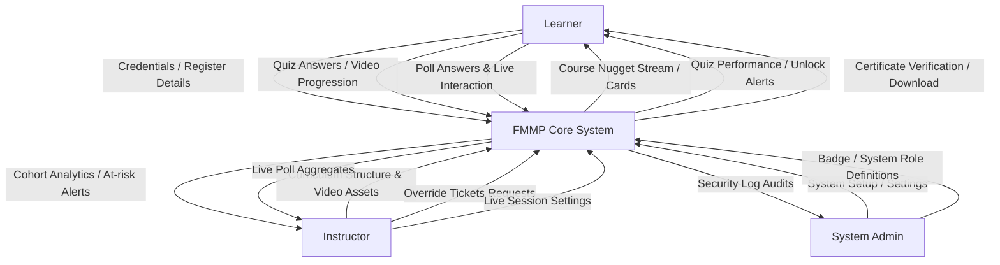
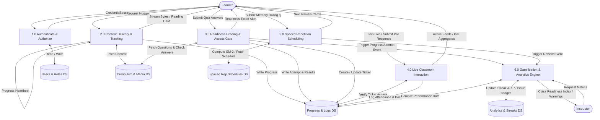
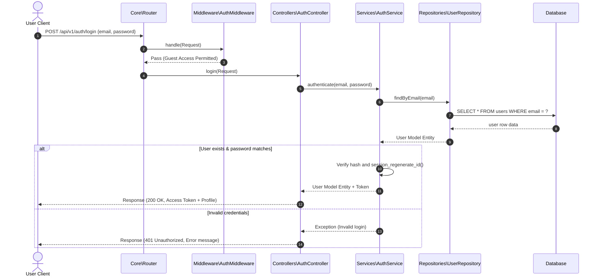
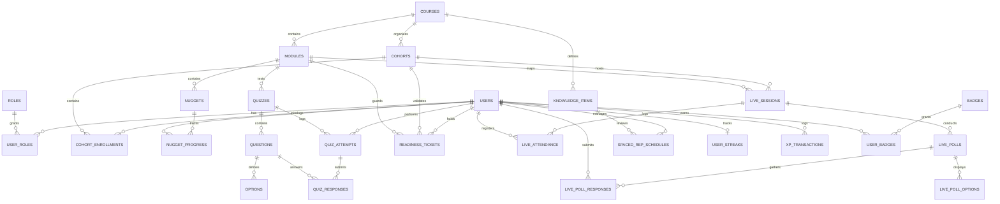

# Engineering Roadmap & Sprint Schedules
## Flipped-Microlearning MOOC Platform (FMMP)

This document establishes the sprint-based roadmap for the FMMP project. The execution path is structured into **ten sequential 2-week sprints** mapped from system requirements, specifying effort estimates (Story Points), priority, dependencies, and deliverables.

*   **Global Architecture:** [ARCHITECTURE.md](file:///d:/xamp/htdocs/fitcoch/docs/ARCHITECTURE.md)
*   **Module Breakdown:** [MODULES.md](file:///d:/xamp/htdocs/fitcoch/docs/MODULES.md)
*   **REST API Directory:** [API_SPEC.md](file:///d:/xamp/htdocs/fitcoch/docs/API_SPEC.md)
*   **Performance Sizing:** [PERFORMANCE.md](file:///d:/xamp/htdocs/fitcoch/docs/PERFORMANCE.md)

---

## 1. Roadmap Executive Summary

The roadmap starts with Sprint 0.5 to align specifications and design diagrams, followed by building the core application foundation, content delivery mechanisms, interactive classroom loops, cognitive retention engines, and finally engagement mechanics.

```
Engineering Roadmap Dependency Path
┌────────────────────────────────────────────────────────┐
│ Sprint 0.5: Design & Diagrams (DFD, ERD, Use Case)     │
└──────────────────────────┬─────────────────────────────┘
                           ▼
┌────────────────────────────────────────────────────────┐
│ Sprint 1: Authentication                               │
└──────────────────────────┬─────────────────────────────┘
                           ▼
┌────────────────────────────────────────────────────────┐
│ Sprint 2: User Profiles & Timezones                    │
└──────────────────────────┬─────────────────────────────┘
                           ▼
┌────────────────────────────────────────────────────────┐
│ Sprint 3 & 4: Course, Lessons & Video Streaming        │
└──────────────────────────┬─────────────────────────────┘
                           ▼
┌────────────────────────────────────────────────────────┐
│ Sprint 5: Quiz & Readiness Gate                        │
└──────────────────────────┬─────────────────────────────┘
                           ▼
┌────────────────────────────────────────────────────────┐
│ Sprint 6 & 7: Live WebRTC Class & Spaced Repetition    │
└──────────────────────────┬─────────────────────────────┘
                           ▼
┌────────────────────────────────────────────────────────┐
│ Sprint 8 & 9: Gamification, Analytics & Certificates   │
└────────────────────────────────────────────────────────┘
```

---

## 2. Sprint Timeline & Execution Details

### 2.0 Sprint 0.5: Architecture Design & Diagrams
*   **Focus:** Prepare system conceptual diagrams, including Data Flow Diagram (DFD), Use Case Diagram, Sequence Diagram, and Entity-Relationship (ER) Diagram.
*   **Effort Estimate:** 5 Story Points (3 developer days)
*   **Priority:** High
*   **Dependencies:** None (Initiation Phase)
*   **Deliverables:**

#### A. Use Case Diagram
Maps the system boundaries, primary actors (Learner, Instructor, System Admin, System Engine), and critical business use cases.

```mermaid
graph TD
    Learner((Learner))
    Instructor((Instructor))
    Admin((System Admin))
    SystemEngine((System Engine))

    subgraph Use Cases
        UC1[Authenticate & Profile Settings]
        UC2[Consume Lesson Nugget]
        UC3[Attempt Readiness Quiz]
        UC4[Join Live Session]
        UC5[Submit In-Class Poll Answer]
        UC6[Configure Course & Nuggets]
        UC7[Override Readiness Tickets]
        UC8[View Analytics Dashboard]
        UC9[Trigger Spaced Repetition Quiz]
        UC10[Update Streak & Award XP]
        UC11[Issue Mastery Certificate]
    end

    Learner --> UC1
    Learner --> UC2
    Learner --> UC3
    Learner --> UC4
    Learner --> UC5
    Learner --> UC9
    Learner --> UC10

    Instructor --> UC1
    Instructor --> UC6
    Instructor --> UC7
    Instructor --> UC8
    Instructor --> UC4

    Admin --> UC1
    Admin --> UC8
    Admin --> UC11

    SystemEngine --> UC9
    SystemEngine --> UC10
    SystemEngine --> UC11
```



#### B. Data Flow Diagram (DFD)
Shows how data transitions between external actors, processes, and databases.

##### DFD Level 0 (Context Diagram)


##### DFD Level 1 (Process Diagram)


#### C. Sequence Diagram (User Login & Auth Validation)
Trace of sequence components during credential audits.



#### D. Entity-Relationship (ER) Diagram
Logical database modeling mapping cardinality links between core schemas.



---

### 2.1 Sprint 1: Authentication Core
*   **Focus:** Establish framework directories, Database connection layers, custom Dependency Injection (DI) Container, and basic login session handling.
*   **Effort Estimate:** 8 Story Points (5 developer days)
*   **Priority:** Critical
*   **Dependencies:** None (Base Bootstrap)
*   **Deliverables:**
    1.  Initialize custom DI Container (`Core\Container.php`) and Router.
    2.  Setup DB connections pool (`Core\Database.php`) with MySQL 8.
    3.  Create Auth Controller (`app/Controllers/AuthController.php`) handling login/register endpoints.
    4.  Configure secure HTTP-Only session cookie rules.
*   **Mitigation Strategy:** Establish integration unit tests for DI container dependency resolution before building routes.

---

### 2.2 Sprint 2: User Profiles & Role Management
*   **Focus:** Build user directories, manage profile data, set up localized timezones, and verify Role-Based Access Control (RBAC) middleware.
*   **Effort Estimate:** 5 Story Points (3 developer days)
*   **Priority:** Critical
*   **Dependencies:** Sprint 1 (Auth session context)
*   **Deliverables:**
    1.  Create `roles` and `user_roles` database schemas.
    2.  Configure `RoleMiddleware` checking user credentials.
    3.  Develop User Profile settings views (`app/Views/auth/profile.php`) allowing timezone configurations.
    4.  Expose `/api/v1/users/me` endpoint.

---

### 2.3 Sprint 3: Course Curriculum Structures
*   **Focus:** Develop core relational schemas for Course catalogs, Cohorts runs, Syllabus modules, and asynchronous enrollment paths.
*   **Effort Estimate:** 8 Story Points (5 developer days)
*   **Priority:** High
*   **Dependencies:** Sprint 2 (User profiles mapping)
*   **Status:** ✅ Complete (incl. instructor cohort management UI at `/instructor/courses/{id}/cohorts`)
*   **Deliverables:**
    1.  Create database tables for `courses`, `cohorts`, and `cohort_enrollments`.
    2.  Build course listing and outline views for students.
    3.  Implement Course Creator view interface for instructors.
    4.  Build Course and Module model validation routines.

---

### 2.4 Sprint 4: Lessons (Nuggets) & Video Streaming
*   **Focus:** Deliver microlearning content cards and implement chunk-based video streaming supporting byte-range player scrub requests.
*   **Effort Estimate:** 13 Story Points (8 developer days)
*   **Priority:** High
*   **Dependencies:** Sprint 3 (Course trees)
*   **Deliverables:**
    1.  Create `nuggets` and `nugget_progress` schemas.
    2.  Implement `VideoService.php` handling `206 Partial Content` ranges.
    3.  Develop custom HTML5 video player integration in lesson view.
    4.  Setup client heartbeats updates calling `/api/v1/nuggets/{id}/progress`.
*   **Mitigation Strategy:** Use `finfo` server validations to block arbitrary file types on video upload endpoints.

---

### 2.5 Sprint 5: Quiz Engine & Readiness Gate
*   **Focus:** Validate student pre-class preparation via quizzes, unlocking access tickets for live session entry.
*   **Effort Estimate:** 10 Story Points (6 developer days)
*   **Priority:** High
*   **Dependencies:** Sprint 4 (Lesson progress checks)
*   **Status:** ✅ Complete (incl. instructor readiness panel with latest quiz scores and lock-back)
*   **Deliverables:**
    1.  Develop tables for `quizzes`, `questions`, `options`, and `readiness_tickets`.
    2.  Create quiz grading calculations logic.
    3.  Build automatic readiness ticket unlocks status loops ($score \ge 80\%$).
    4.  Build the manual override tool for instructors.

---

### 2.6 Sprint 6: Module Discussion Board (แทน Live Classroom)
*   **Focus:** Per-unit discussion board for learners to exchange thoughts during pre-class microlearning.
*   **Effort Estimate:** 8 Story Points (5 developer days)
*   **Priority:** High
*   **Dependencies:** Sprint 4 (Lesson pages), Sprint 3 (Enrollment)
*   **Status:** ✅ Complete — sidebar discussion panel on nugget/quiz pages
*   **Note:** Replaces original Live WebRTC scope (Sprint 6/7 Live deferred/removed from plan)
*   **Deliverables:**
    1.  Create `module_discussions` schema.
    2.  Build discussion post/create flow per module.
    3.  Embed discussion board in lesson sidebar (below lesson list).

---

### 2.7 Sprint 7: Live Classroom Interactions — REMOVED FROM PLAN
*   **Original Focus:** WebSocket polls and chat for live sessions.
*   **Status:** ❌ Removed — replaced by Module Discussion Board (Sprint 6 revision).
*   **Note:** Basic `/live` stub code remains in repo but is not on the active roadmap.

---

### 2.8 Sprint 8: Spaced Repetition (SM-2 Engine)
*   **Focus:** Calculate cognitive recall spacing schedules using SuperMemo-2 mathematical models to output daily student reviews.
*   **Effort Estimate:** 13 Story Points (8 developer days)
*   **Priority:** Medium
*   **Dependencies:** Sprint 5 (Quiz structures)
*   **Status:** ✅ MVP complete (`/review/daily`, SM-2 engine, API, dashboard CTA) — CRON scheduler & review dashboard pending
*   **Deliverables:**
    1.  Create `knowledge_items` and `spaced_rep_schedules` schemas.
    2.  Build `QuizService::calculateSM2` formulas.
    3.  Deploy a CRON background scheduler routing daily queues based on user timezones.
    4.  Build rapid-fire review quiz card layouts.

---

### 2.9 Sprint 9: Gamification, Analytics & Certificates
*   **Focus:** Build engagement metrics (streaks, XP, badges), compile class readiness indexes, and generate dynamically verify-able certificates.
*   **Effort Estimate:** 13 Story Points (9 developer days)
*   **Priority:** Medium
*   **Dependencies:** Sprint 8 (Daily review schedules)
*   **Deliverables:**
    1.  Create `user_streaks`, `xp_transactions`, and `user_badges` schemas.
    2.  Implement timezone-aligned streak check loops (BR-02).
    3.  Build class analytics monitor (readiness ratings, misconceptions alert triggers).
    4.  Expose certificate verification URLs and PDF download routes.
*   **Mitigation Strategy:** Cache analytics indexes on Redis server to prevent database lock issues during class loads.
