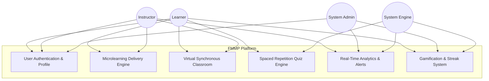
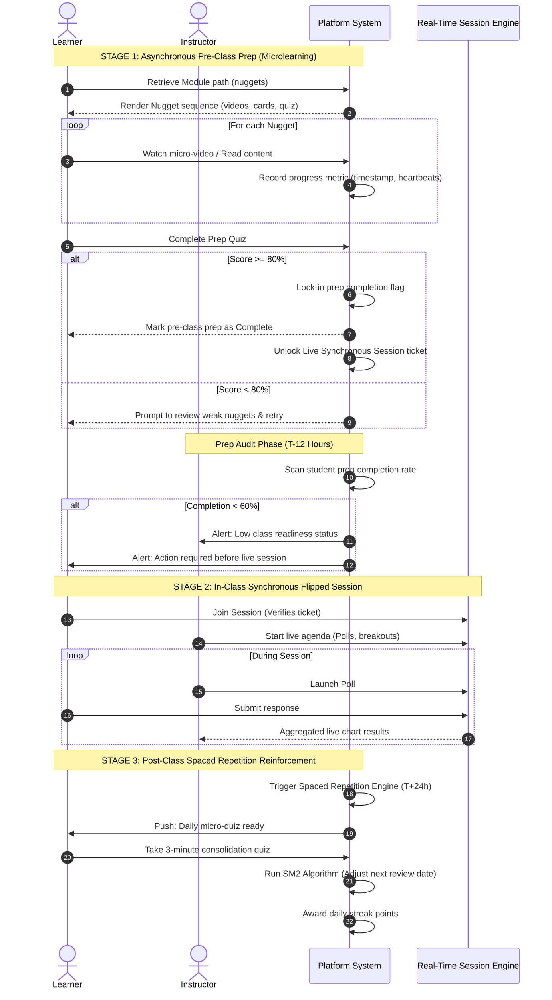
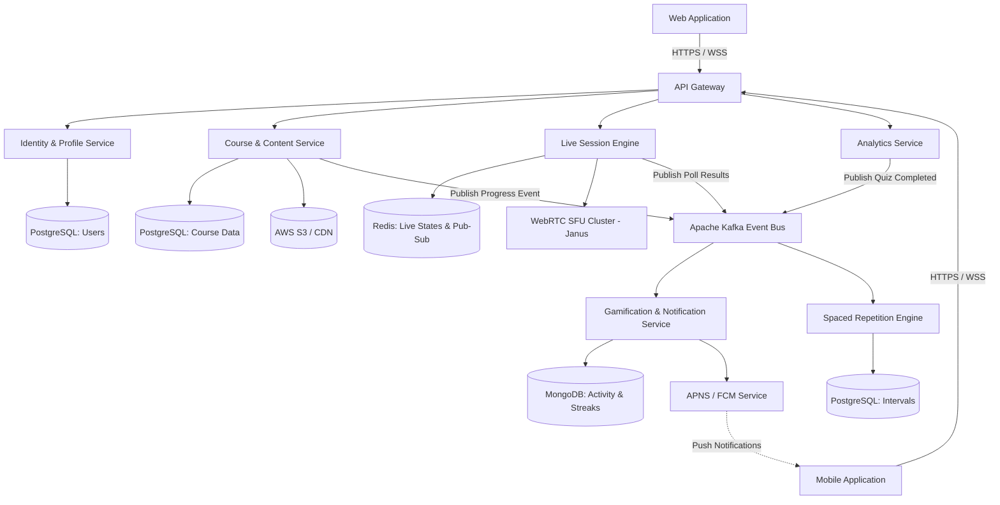

# Software Requirement Specification (SRS)
## Massive Open Online Course (MOOC) Platform using Flipped Classroom and Microlearning

---

### Document Metadata
*   **System Title:** Flipped-Microlearning MOOC Platform (FMMP)
*   **Version:** 1.0.0
*   **Date:** July 14, 2026
*   **Status:** Approved Draft for Engineering
*   **Author:** Senior Software Architect
*   **Workspace Location:** `C:\Users\wpach\.gemini\antigravity\scratch\mooc-flipped-microlearning`

---

## 1. Introduction & Objectives

### 1.1 Purpose
This Software Requirement Specification (SRS) document details the functional, non-functional, behavioral, and architectural requirements for the Flipped-Microlearning MOOC Platform (FMMP). It provides a single source of truth for engineering teams, quality assurance, product managers, and educational designers.

### 1.2 System Scope
Traditional MOOCs suffer from low completion rates (typically < 10%) due to long-form lectures and passive learning. This platform implements a hybrid pedagogical model:
1.  **Microlearning:** Knowledge is divided into atomic, self-contained educational segments (typically 3–7 minutes), referred to as **"Learning Nuggets"** (short videos, reading cards, quizzes, flashcards).
2.  **Flipped Classroom:** Learners complete pre-class microlearning modules asynchronously to acquire base concepts. Live, synchronous virtual sessions are reserved for active learning, interactive exercises, peer discussions, and Q&A with instructors.

### 1.3 Intended Audience
*   **Backend & Frontend Engineering:** For implementation of services, APIs, databases, and UI interfaces.
*   **QA Engineers:** To design test suites, load-test configurations, and verify acceptance criteria.
*   **Instructional Designers & Instructors:** To understand course authoring boundaries and pedagogical flows.
*   **Product Owners:** To track functional completeness and plan releases.

---

## 2. Actors & System Boundaries

The system identifies four primary actors interacting with the boundaries of the application:



### 2.1 Learner (Student)
*   Consumes bite-sized microlearning content (nuggets) asynchronously.
*   Performs self-assessment via pre-class validation tests.
*   Attends scheduled live flipped-classroom synchronous sessions.
*   Participates in real-time polls, breakout rooms, and peer discussions.
*   Engages in daily post-class spaced repetition reinforcement activities.
*   Tracks personal learning progress, streaks, achievements, and leaderboard standings.

### 2.2 Instructor (Educator / Course Creator)
*   Authors and organizes microlearning paths (nuggets structure).
*   Configures in-class synchronous agenda items, polls, and breakout tasks.
*   Monitors student pre-class readiness metrics via analytics dashboards.
*   Facilitates live synchronous sessions with real-time feedback tools.
*   Evaluates post-class consolidation statistics and adjusts content accordingly.

### 2.3 System Administrator
*   Manages system configurations, integrations (e.g., LTI, zoom/WebRTC setups), and database health.
*   Audits compliance (GDPR/COPPA) and access control profiles.
*   Manages course catalogs, categories, global game rules, and badging configurations.

### 2.4 System Engine (Automated Actor)
*   **Spaced Repetition Scheduler:** Calculates intervals for student recall activities based on cognitive science algorithms.
*   **Gamification Processor:** Automatically awards achievements, checks streak breaks, and distributes points.
*   **Alert & Notification Dispatcher:** Triggers push/email alerts for pre-class completion rates and pending live sessions.

---

## 3. The Learning Workflow

The FMMP core workflow follows a cyclical, three-stage loop for each module: **Asynchronous Preparation** $\rightarrow$ **Synchronous Collaboration** $\rightarrow$ **Asynchronous Reinforcement**.



---

## 4. Functional Requirements

### 4.1 Microlearning Content Delivery & Pathing (Asynchronous)
*   **FR-1.1:** The system shall support multiple microlearning formats: short-form video (max 7 mins), textual content cards, infographics, audio snippets, and short quizzes (max 5 questions).
*   **FR-1.2:** The system shall track granular user progression inside a nugget (e.g., video playback percentage, scroll depth on content cards).
*   **FR-1.3:** The system shall support offline caching on mobile devices, allowing learners to download micro-nuggets and sync completion progress when a connection is restored.
*   **FR-1.4:** The system shall enforce sequential unlocking of nuggets within a module, preventing learners from skipping ahead unless the instructor has disabled progression constraints.

### 4.2 Pre-Class Readiness & Access Control (Flipped Gates)
*   **FR-2.1:** The system shall require learners to complete all pre-class micro-nuggets and score $\ge 80\%$ on the "Readiness Quiz" to unlock the registration ticket for the synchronous live class.
*   **FR-2.2:** The system shall provide instructors with a "Manual Overwrite" tool to grant entry access to learners who failed to meet the automated entry conditions.
*   **FR-2.3:** The system shall automatically close pre-class submissions and lock readiness states 1 hour prior to the scheduled live session to freeze the analytics dashboard.

### 4.3 Virtual Synchronous Classroom Interface
*   **FR-3.1:** The system shall host high-quality, WebRTC-enabled virtual classrooms supporting video, audio, screen share, and group chat.
*   **FR-3.2:** The system shall display a real-time "Readiness Indicator" next to each participant's avatar in the room, visible to the instructor, indicating if they finished the pre-class prep.
*   **FR-3.3:** The system shall feature a live synchronized timeline showing the class agenda (e.g., 10m Q&A, 15m Poll Activity, 20m Breakout).

### 4.4 In-Class Interactive Features
*   **FR-4.1:** The system shall allow instructors to launch real-time single-choice, multiple-choice, and open-ended polls to all participants instantly.
*   **FR-4.2:** The system shall support Peer Instruction flows: Launch Poll $\rightarrow$ Individual Answer $\rightarrow$ Breakout discussion (auto-grouped by opposing answers) $\rightarrow$ Re-poll $\rightarrow$ Reveal.
*   **FR-4.3:** The system shall support dynamic breakout rooms with shared visual workspaces (virtual whiteboards) that persist back to the main room upon termination.

### 4.5 Post-Class Spaced Repetition Engine
*   **FR-5.1:** The system shall automatically generate daily personalized micro-quizzes (3–5 questions) containing high-priority review questions calculated by the Spaced Repetition algorithm.
*   **FR-5.2:** The system shall determine the repeat interval of specific knowledge objects using an adaptive cognitive spacing algorithm based on the learner's response speed and correctness.
*   **FR-5.3:** If a learner consistently fails a concepts threshold, the system shall append a corrective microlearning card to their queue.

### 4.6 Learning Analytics & Dashboards
*   **FR-6.1:** The system shall provide instructors with an aggregated "Class Readiness Index" showing prep completion rates, average quiz scores, and identified conceptual misconceptions prior to class.
*   **FR-6.2:** The system shall flag and display "At-Risk Learners" who have failed to complete pre-class preparation for three consecutive sessions.
*   **FR-6.3:** The system shall compile post-session dashboards analyzing live participation engagement scores, poll accuracy, and post-class spacing performance.

### 4.7 Gamification & Engagement Mechanics
*   **FR-7.1:** The system shall maintain a "Daily Habit Streak" counter for learners, incrementing upon daily completion of either pre-class nuggets or post-class spaced repetition quizzes.
*   **FR-7.2:** The system shall award Experience Points (XP) for activities: 10 XP for nugget read, 50 XP for perfect quiz, 100 XP for attending live sessions.
*   **FR-7.3:** The system shall display context-based, non-coercive leaderboards focusing on streak sizes and progress rates rather than raw quiz scores, to prevent learner anxiety.

---

## 5. Non-Functional Requirements

### 5.1 Performance & Scalability (MOOC Scale)
*   **NFR-1.1 (Concurrency):** The system must support up to 500,000 active users platform-wide and up to 10,000 concurrent participants in a single live synchronous cohort without UI stuttering.
*   **NFR-1.2 (Latency):** Real-time communications (polling inputs, chat messages, whiteboard updates) must reach all session users within a target latency of $<250\text{ ms}$ (95th percentile).
*   **NFR-1.3 (Load times):** Initial load time for a microlearning nugget page on standard 3G mobile networks must be under $2.0\text{ seconds}$.

### 5.2 Availability & Reliability
*   **NFR-2.1 (Uptime):** The system must guarantee a $99.95\%$ overall uptime (excluding scheduled maintenance) evaluated over a calendar year.
*   **NFR-2.2 (Fault Tolerance):** Failure of the live synchronous video service must not disrupt the asynchronous microlearning delivery engine or spaced repetition features.
*   **NFR-2.3 (RTO/RPO):** Recovery Time Objective (RTO) for the primary course datastore must be $< 1\text{ hour}$, and Recovery Point Objective (RPO) must be $< 5\text{ minutes}$.

### 5.3 Security & Compliance
*   **NFR-3.1 (Encryption):** All data in transit must be encrypted using TLS 1.3, and data at rest must use AES-256 encryption.
*   **NFR-3.2 (Compliance):** The platform must fully comply with GDPR (EU), COPPA (US children's privacy), and FERPA (educational records).
*   **NFR-3.3 (Authentication):** User authentication must support Multi-Factor Authentication (MFA) and external OAuth2 federated log-in providers (Google, Microsoft, Github).

### 5.4 Usability & Accessibility
*   **NFR-4.1 (WCAG):** The user interface must comply with the Web Content Accessibility Guidelines (WCAG) 2.1 Level AA standards (including keyboard navigability and screen-reader support).
*   **NFR-4.2 (Responsiveness):** UI elements must adapt dynamically to screens from 320px width (older smartphones) to 3840px (4K monitors).
*   **NFR-4.3 (Media compression):** The system must auto-transcode uploaded micro-videos down to multiple bitrates (1080p, 720p, 480p, 240p) to match mobile connection speeds dynamically.

---

## 6. Business Rules

| Rule ID | Rule Title | Description / Logic |
| :--- | :--- | :--- |
| **BR-01** | **Access Verification Gate** | `Join_Live_Session(Learner_ID, Session_ID)` returns `True` **IF AND ONLY IF** `Completed_Nugget_Ratio(Learner_ID, Module_ID) == 1.0` **AND** `Readiness_Quiz_Score(Learner_ID, Module_ID) >= 80%`, OR `Instructor_Override(Learner_ID, Session_ID) == True`. Otherwise, returns `False`. |
| **BR-02** | **Daily Streak Logic** | A user’s streak increments daily if a user records a `System_Activity_Log` of type `NUGGET_COMPLETED` or `SPACED_REP_QUIZ_SUBMITTED` between `00:00:00` and `23:59:59` according to their local timezone settings. If no logs exist, the streak is reset to `0`. |
| **BR-03** | **Spaced Repetition Algorithm** | Memory interval ($I$) of question items must follow a modified SuperMemo-2 (SM-2) algorithm. For trial $n$: $I(1) = 1$, $I(2) = 6$, and $I(n) = I(n-1) \times EF$ (Easiness Factor, calculated from rating feedback 0-5). If rating $< 3$, reset progress step ($n = 1$). |
| **BR-04** | **Instructor Alert Threshold** | At $T - 12\text{ hours}$ from `Live_Session_Start_Time`, if `Count_Completed_Prep(Cohort) / Count_Total_Cohort(Cohort) < 0.60`, trigger a system flag `LOW_PREPARATION_ALERT` directly to the instructor's dashboard. |
| **BR-05** | **Streak Protection (Shield)** | A learner can purchase "Streak Freeze" using earned XP points (Cost: 1,000 XP). This shield automatically activates if a learner misses a day, consuming the shield but preserving the streak counter. |

---

## 7. Use Case List

| UC ID | Use Case Name | Primary Actor | Preconditions | Postconditions |
| :--- | :--- | :--- | :--- | :--- |
| **UC-101** | Consume Microlearning Nugget | Learner | Learner is enrolled in the course. | Nugget state is marked "Completed"; XP is awarded; metrics logged. |
| **UC-102** | Attempt Readiness Quiz | Learner | Micro-nuggets of the module are marked completed. | Score is saved. If $\ge 80\%$, the Flipped live ticket unlocks. |
| **UC-103** | Join Synchronous Live Class | Learner | Live session is active; Learner holds unlocked ticket or override. | Learner is connected to WebRTC stream and active session chat. |
| **UC-104** | Participate in Real-Time Poll | Learner | Connected to Live Class; Instructor has published a poll. | Response stored; results aggregated; points awarded. |
| **UC-105** | Setup Flipped Course Module | Instructor | Instructor has write access to course curriculum. | Learning path, nuggets, and quizzes are created and published. |
| **UC-106** | View Class Readiness Dashboard| Instructor | Flipped class is scheduled. | Live graph showing student preparation rates and weak areas is rendered. |
| **UC-107** | Generate Daily Spaced Rep | System Engine | Schedule checks at local midnight. | A targeted quiz packet is generated and queued for the user. |

---

## 8. User Stories & Acceptance Criteria

### User Story 1: Pre-Class Preparation Gate (Learner)
*   **As a** Learner,
*   **I want to** complete my bite-sized micro-nuggets and take the readiness quiz on my phone,
*   **So that** I can unlock entry to the synchronous active learning class.

#### Acceptance Criteria
```gherkin
Scenario: Unlocking live ticket with successful preparation score
  Given the Learner has finished watching all 3 micro-videos in "Module 2"
  And the Learner has read all associated text cards
  When the Learner takes the "Module 2 Readiness Quiz"
  And achieves a score of 90% (greater than the 80% threshold)
  Then the system displays a confirmation message "Live Ticket Unlocked!"
  And updates the Learner's profile to permit joining the live session
  And awards the Learner 150 XP.

Scenario: Failing the readiness threshold
  Given the Learner has finished all pre-class materials in "Module 2"
  When the Learner takes the "Module 2 Readiness Quiz"
  And achieves a score of 60% (less than the 80% threshold)
  Then the system displays "Score: 60%. Retake required to unlock Live Session."
  And restricts access to the "Join Live Class" button
  And highlights the specific micro-nugget related to the wrong answers for review.
```

### User Story 2: Live In-Class Polling (Instructor & Learner)
*   **As an** Instructor,
*   **I want to** trigger a live question with a short countdown during class,
*   **So that** I can assess student understanding of the concepts in real time.

#### Acceptance Criteria
```gherkin
Scenario: Running a live session poll
  Given the Instructor is hosting the live virtual classroom with 150 students
  And the students are joined in the interactive pane
  When the Instructor clicks "Launch Poll: concept_quiz_2"
  Then all students receive a slide overlay displaying the question and options
  And a 60-second timer begins count down on all client screens
  And as students submit, the Instructor's dashboard updates with an anonymized live distribution bar chart
  And when the timer hits 0, the poll locks and the system displays the correct answer to all participants.
```

### User Story 3: Preparation Alert Dashboard (Instructor)
*   **As an** Instructor,
*   **I want to** view a dashboard indicating who has completed the pre-class prep 12 hours before class,
*   **So that** I can adapt the live session agenda to focus on sections where learners struggled.

#### Acceptance Criteria
```gherkin
Scenario: Reviewing readiness analytics before the class
  Given the Instructor has a live classroom scheduled for "10:00 AM July 15"
  When the Instructor accesses the "Course Readiness Dashboard" at "10:00 PM July 14" (T-12 Hours)
  Then the system displays the aggregate completion rate (e.g., "72%")
  And lists the top 3 concepts failed in the Readiness Quiz (e.g., "Recursion Depth Limit")
  And lists the names of learners who have not completed the preparation yet
  And displays an option button to "Send Direct Push Reminder to Underprepared Users."
```

---

## 9. Risk Analysis & Mitigation Strategies

The platform's reliance on asynchronous learner preparation before active-learning sessions introduces specific pedagogical and technical risks:

| Risk ID | Identified Risk | Impact | Probability | Mitigation Strategy |
| :--- | :--- | :--- | :--- | :--- |
| **R-01** | **The "Unflipped" Classroom:** Learners fail to complete pre-class nuggets, leaving the live session group activities dysfunctional. | High | High | Keep pre-class nuggets strictly under 5 minutes; send automated mobile push notifications 24 hours and 12 hours prior to class; use the Prep Gate rule to enforce accountability; design "warm-up" micro-activities. |
| **R-02** | **WebRTC Live Scale Failure:** High load from thousands of concurrent video/audio links collapses the signaling server during live sessions. | Critical | Medium | Use SFU (Selective Forwarding Unit) media servers configured for horizontal auto-scaling (e.g., Mediasoup, Janus); automatically mute learner video feeds if the cohort size exceeds 50, limiting streams to the active instructors. |
| **R-03** | **Mobile Offline Desync:** Progress completed offline is lost or overwrites later progress, leading to learner frustration. | Medium | High | Implement vector clocks and optimistic offline sync storage on the client client. Maintain detailed state change logs with timestamps to resolve conflicting database merges gracefully. |
| **R-04** | **Spaced Repetition Fatigue:** Frequent push alerts for daily consolidation quizzes trigger notification fatigue, causing app uninstalls. | Medium | High | Integrate gamification (streaks, double-XP events) directly with spaced repetition; allow users to group review prompts into customized digest options; configure adaptive timing thresholds. |

---

## 10. Recommended System Architecture

To meet high scalability requirements, ensure fault tolerance, and support real-time user interaction, the recommended architecture is an **Event-Driven Microservices Architecture** deployed on an auto-scaled cloud cluster (e.g., AWS EKS/Kubernetes).

### 10.1 Architectural Components & Services
1.  **API Gateway (Kong / AWS API Gateway):** Handles routing, TLS termination, global rate limiting, and authenticates JWT tokens.
2.  **Identity & Profile Service:** Manages user registration, profiles, roles, and MFA authentication. (DB: PostgreSQL)
3.  **Course & Micro-Content Service:** Manages course trees, micro-learning nuggets (HTML cards, file paths, metadata), quiz questions, and release sequences. (DB: PostgreSQL for relations, Cloudflare CDN / AWS S3 for video/media storage).
4.  **Activity & Progress Service:** High-throughput logging service recording every user interaction (nugget read depth, video heartbeats, click patterns). (DB: MongoDB or DynamoDB for schema flexibility and fast writes).
5.  **Live Interaction Engine:** Manages synchronous session signals, active polls, chat, and whiteboard syncing using WebSockets and Redis Pub/Sub for sub-millisecond distribution.
6.  **Spaced Repetition Engine:** Analyzes response history to queue review items. (DB: PostgreSQL).
7.  **Gamification & Notification Service:** Checks and awards streaks, points, levels, and fires email/push channels. (Broker: RabbitMQ / Apache Kafka).

### 10.2 Global System Architecture



### 10.3 Core Technology Stack Rationale

*   **Frontend Client:** React / Next.js for web (SEO optimization and Server-Side Rendering for course details pages), React Native for mobile (code reuse across iOS/Android, offline storage capabilities).
*   **Backend Services:** Node.js (TypeScript) for high-performance I/O applications like the Live Session Engine and Progress Tracker; Go (Golang) for CPU-bound services like the Spaced Repetition scheduler and analytics calculators.
*   **Databases:**
    *   **PostgreSQL:** Handles strongly structured relations requiring transactional consistency (User accounts, financial items, course hierarchies, scheduled dates).
    *   **MongoDB / DynamoDB:** Stores student activity streams. The documents are dynamic and write speeds must scale rapidly.
    *   **Redis Cluster:** Serves as a volatile cache, user presence tracker, and real-time pub/sub manager for instant poll distribution.
*   **Messaging System:** Apache Kafka serves as the backbone event-bus, enabling decoupled services to consume user activities (e.g., updating streaks, logging instructor analytics, calculating spaced repetition queues asynchronously without locking the primary user paths).
*   **Real-time Media:** Janus or Mediasoup WebRTC servers. Using an SFU (Selective Forwarding Unit) instead of MCU (Multipoint Control Unit) saves CPU resource costs on the cloud by routing video packets directly without transcoding.
